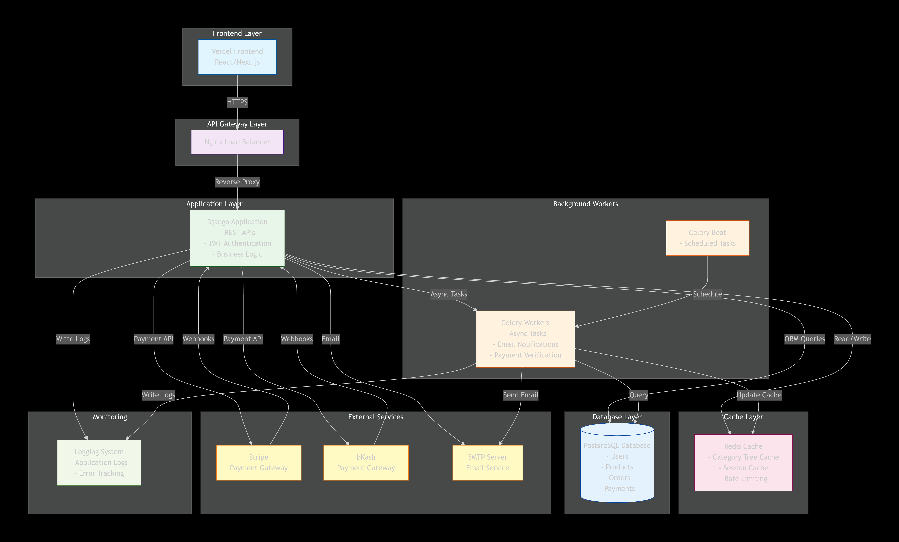

# E-commerce System Documentation

## Diagrams

### 1. System Architecture

This diagram shows the overall system architecture including:
- Frontend (Vercel)
- API Gateway (Nginx)
- Application Layer (Django)
- Background Workers (Celery)
- Cache Layer (Redis)
- Database (PostgreSQL)
- External Services (Stripe, bKash, SMTP)
- Monitoring (Logging)

### 2. Database ERD

The Entity-Relationship diagram shows all database tables and their relationships:
- Users
- Categories (self-referencing for hierarchy)
- Products
- Orders
- OrderItems
- Payments

### 3. Payment Flows

#### Stripe Payment Flow

#### bKash Payment Flow

## Key Features Implemented

1. **OOP Design**: All business logic organized in classes
2. **Strategy Pattern**: Payment providers interchangeable
3. **DFS + Caching**: Category tree with Redis caching
4. **JWT Authentication**: Secure API access
5. **Webhook Support**: Async payment notifications
6. **Docker Deployment**: Containerized application

## Technology Stack

- **Backend**: Django 4.2, Django REST Framework
- **Database**: PostgreSQL 15
- **Cache**: Redis 7
- **Task Queue**: Celery
- **Payment**: Stripe, bKash
- **Deployment**: Docker, Gunicorn, Nginx